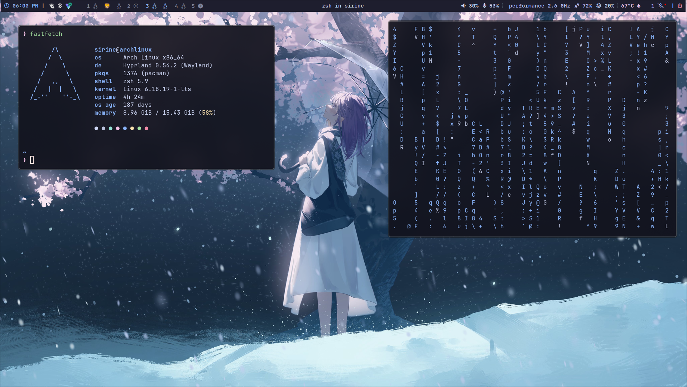
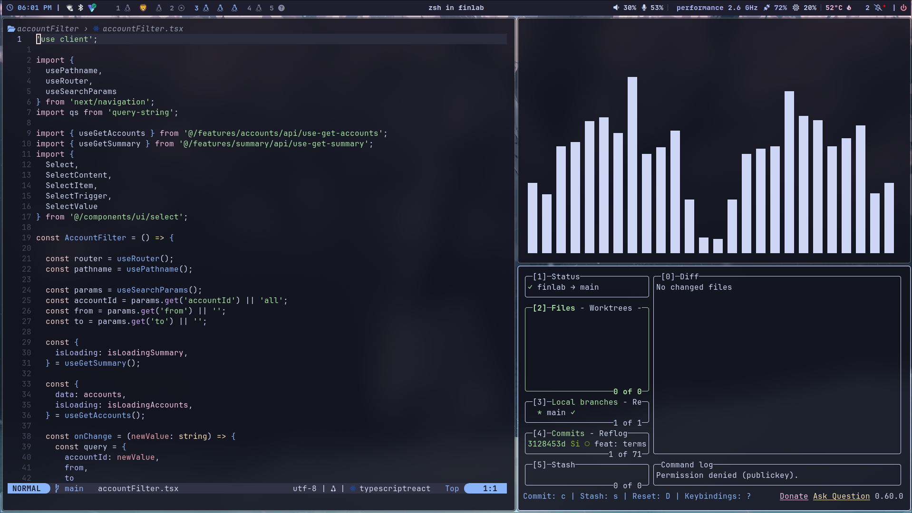

<div align="center">

```
        /\
       /  \
      / /\ \
     / /  \ \
    / / /\ \ \
   /_/ /  \_\_\
```

# sirine@archlinux

**Arch Linux** · **Hyprland** · **Wayland** · **zsh**

*my ever-changing dotfiles for my arch hyprland setup.*

</div>

---

## showcase

| desktop | editor |
|---|---|
|  |  |

---

## system

| | |
|---|---|
| **os** | Arch Linux x86_64 |
| **wm** | Hyprland 0.54.2 (Wayland) |
| **shell** | zsh 5.9 |
| **kernel** | Linux 6.18.19-1-lts |
| **terminal** | alacritty |
| **editor** | neovim |
| **browser** | brave |
| **file manager** | thunar / yazi |
| **bar** | waybar |
| **launcher** | rofi |
| **fetch** | fastfetch |
| **monitor** | btop |
| **pdf viewer** | zathura |
| **multiplexer** | tmux |
| **video** | mpv |

---

## structure

```
~/.dotfiles/
├── alacritty/       # terminal
├── brave/           # browser
├── btop/            # system monitor
├── cava/            # audio visualizer
├── fastfetch/       # system info
├── ghostty/         # terminal (alt)
├── hyprland/        # wm — modular config under conf/
├── kitty/           # terminal (alt)
├── lazygit/         # git tui
├── mpv/             # video player
├── nvim/            # editor
├── nwg-displays/    # display manager (monitor-specific)
├── rofi/            # launcher, powermenu, clipboard, display menu
├── shell/           # shared aliases (bash/zsh compatible)
├── tmux/            # multiplexer
├── waybar/          # status bar
├── wlogout/         # logout screen
├── wofi/            # launcher (alt)
├── yazi/            # file manager tui
├── zathura/         # pdf viewer
└── zsh/             # shell config
```

hyprland config is split into modules:

```
hyprland/.config/hypr/conf/
├── animations.conf
├── appearance.conf
├── autostart.conf
├── binds.conf
├── environment.conf
├── input.conf
├── layout.conf
├── misc.conf
├── monitors.conf
├── programs.conf
├── windowrules.conf
└── workspaces.conf
```

---

## keybinds

`$mainMod` = <kbd>Super</kbd>

### applications

| keybind | action |
|---|---|
| `Super + Return` | terminal (alacritty) |
| `Super + E` | file manager (thunar) |
| `Super + B` | browser (brave) |
| `Super + Space` | app launcher (rofi) |

### windows

| keybind | action |
|---|---|
| `Super + W` | close window |
| `Super + V` | toggle floating |
| `Super + F` | fullscreen |
| `Super + Shift + F` | maximize (keep gaps) |
| `Super + T` | float + center + resize to 50×60% |
| `Super + hjkl` | move focus (vim-style) |
| `Super + Shift + hjkl` | move window |
| `Super + Ctrl + hjkl` | resize window |
| `Super + LMB drag` | move window |
| `Super + RMB drag` | resize window |

### workspaces

| keybind | action |
|---|---|
| `Super + 1-9` | switch to workspace |
| `Super + Shift + 1-9` | move window to workspace |
| `Super + Tab` | previous workspace |
| `Super + scroll` | cycle workspaces |

### system

| keybind | action |
|---|---|
| `Super + Escape` | power menu (rofi) |
| `Super + F12` | lock screen (hyprlock) |
| `Super + R` | reload waybar |
| `Super + D` | display menu (rofi) |
| `Super + M` | exit hyprland |

### utilities

| keybind | action |
|---|---|
| `Print` | screenshot — full output |
| `Shift + Print` | screenshot — region |
| `Alt + Print` | screenshot — window |
| `Super + C` | color picker (hyprpicker) |
| `Super + Shift + V` | clipboard history (rofi) |

### media

| keybind | action |
|---|---|
| `XF86AudioRaiseVolume` | volume +5% |
| `XF86AudioLowerVolume` | volume -5% |
| `XF86AudioMute` | toggle mute |
| `XF86MonBrightnessUp` | brightness +5% |
| `XF86MonBrightnessDown` | brightness -5% |

---

## install

> **warning**: don't blindly apply someone else's dotfiles. go through each file and understand what it does first.

### dependencies

```bash
sudo pacman -S stow
git clone https://github.com/sirine/dotfiles ~/.dotfiles
cd ~/.dotfiles
```

### applying configs

```bash
# single config
stow hyprland

# everything at once
stow */

# remove a config
stow -D hyprland
```

### tmux plugins

plugins are managed by [TPM](https://github.com/tmux-plugins/tpm). after stowing the tmux config:

```
prefix + I   →   install plugins
```

### notes

- `secrets.sh` is gitignored — populate `~/.config/profile/secrets.sh` yourself
- `nwg-displays` config is monitor-specific, regenerate it for your setup
- some paths may reference `sirine` — grep and replace as needed

---

## credits

built on the work of countless people in the rice community. nothing here is truly original — just assembled and tweaked to taste. if you recognize your work, thank you.

---

<div align="center">

*btw i use arch*

</div>
